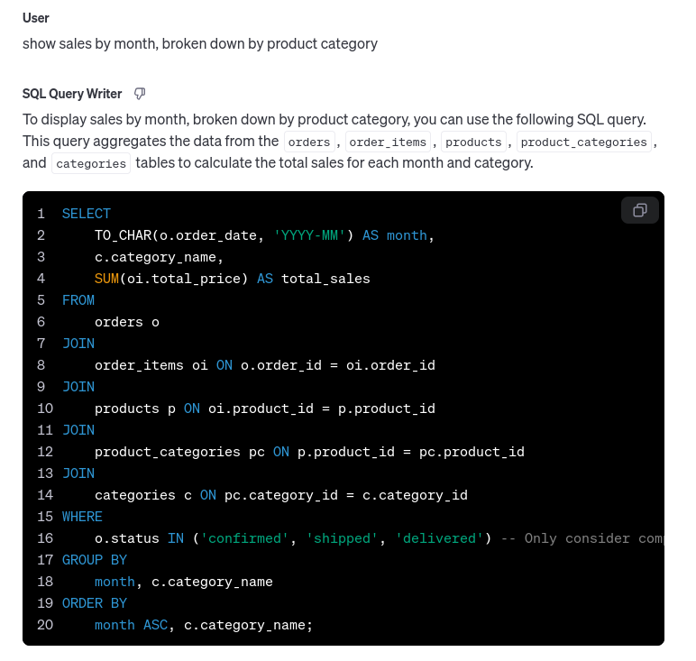

Generative AI tools can make writing SQL very easy: ask a question, and an LLM will translate it into a SQL query that provides the answer. This can save a lot of time for those who are less fluent in SQL. You can ask, "how many orders have been placed by each customer this month?" instead of looking up every table name and working out the `JOIN` and `GROUP BY` syntax. For me, this has been a huge time-saver when analyzing product usage.

There's one annoying part of doing this with most chatbot interfaces, however: you need to provide the DB schema in each new conversation. This article discusses using OpenAI's <a href="https://platform.openai.com/docs/assistants/overview" target="_blank">Assistants Playground</a> to maintain knowledge of your DB schema, allowing you to quickly dive into query creation based on your data.

> There are lots of other tools that can do this such as Claude <a href="https://www.anthropic.com/news/projects" target="_blank">Projects</a> (which is very cool), and specialized "text to SQL" tools. Whatever tool you use, be sure to consider the [privacy and security](#privacy) of the provider!

## Database Schema File

Before an LLM can generate queries, it needs to know our database structure. For this, we'll need a schema definition file.

If you have a schema definition file already, use that. This doesn't have to be SQL: for example, the Prisma ORM has a `schema.prisma` file that you can use. If you don't have a schema file easily available, you can save the existing DB structure to a file using a command like this for PostgreSQL:

```sh
$ pg_dump --schema-only my_db >> my_db_schema_dump.sql
```

For illustration purposes, I've created a DB structure for a fake marketplace app called TradeSphere. The app contains `companies` that are either buyers or sellers, `orders` between the companies, and related data like items, invoices, and payments. Here's a schema diagram:


The full schema and seed data can be found on <a href="https://github.com/naclonts/tradesphere-marketplace" target="_blank">GitHub</a>.


## Upload Schema to OpenAI Assistants Playground

With the Assistants Playground, we can upload our schema file as a reference:


This provides the Assistant with the DB schema moving forward. No more copy-pasting the schema in every conversation! *(Until the next big DB migration, at least...)*

I've also added a system prompt with instructions to reference the schema file, which seemed to help reduce hallucinations. It may be useful to add more context to the system prompt, such as:
- "When relevant, group data by customer."
- "When adding up item costs, include the tax percentage in the total."
- "Call out possible performance impacts. The `orders` table has 5 million records."

> ⚙️ *One bug/feature of the Assistants UX is that it doesn't accept `.sql` files. Rename the schema file's extension to `.txt` to get around this.*

## Ask Questions ➡️ Get SQL Queries

Now we can have fun querying our DB with human language. Let's try a prompt:

> Show me order volume by customer, including how much has been paid and how much is outstanding. Sort by most order volume first.

The playground spits out a SQL query:


Copy-pasting this into a SQL client, we get:


The LLM looks up the requested data, including joining the payments through the `invoices` table.

Cool!

Here's another example:

> show sales by month, broken down by product category



And the results:


## Fact-Checking and Hallucinations

As usual with AI tools, there can be hallucinations. This isn't a replacement for having a good understanding of your datamodel: the LLM can miss nuances that aren't explicitly called out.

Documentation pays off here. If you have a schema definition file where each table has a comment explaining its usage (and ideally, each field has the same), the LLM will use that to construct more accurate queries.

## Privacy

Before using AI for production data or code, you need to think about where the information is going.

Is the AI provider training on your data? This could potentially lead to your IP being leaked. As of writing, the OpenAI API, including the Assistants API and Playground, doesn't train on any data per their <a href="https://openai.com/enterprise-privacy/" target="_blank">policies</a> at the time of writing. Check out current terms before sharing sensitive information on any platform!

Even with that assurance, many of us want to minimize — or completely eliminate — the exposure of actual database records to third-party providers. In some cases, this may even be a contractual or regulatory requirement. With the approach described here, we aren't sending any actual data through the LLM. Only the DB schema is sent to OpenAI.

That being said, consider privacy and security carefully for your use case. These same techniques can be used with an open-source, self-hosted LLM for maximum privacy. Generate a little code for a UX or command-line interface, and you've built your own SQL data analyst.

## Let's Go Build (the right) Stuff 🚀

Speaking for myself, I've often underestimated the value of DB analysis to determine where problems might lie in an application. Being able to iterate through SQL queries quickly and easily removes one hurdle to digging into the data.

Data > code. Let's use it to make better software.
