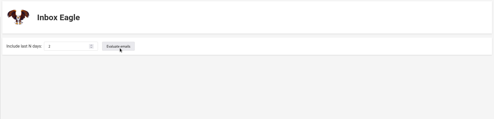
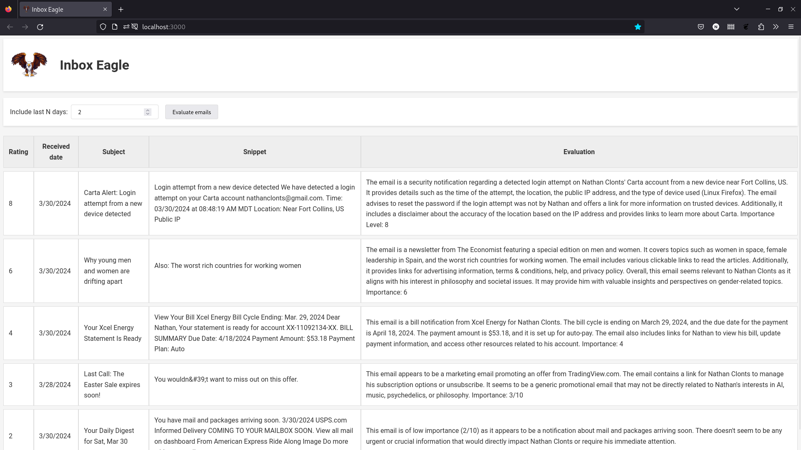
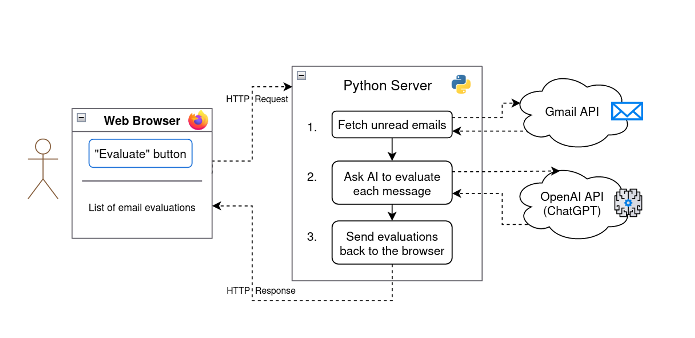

> This article describes an email assistant application that uses AI to prioritizes a message inbox, using the Gmail API and prompt chaining with a Large Language Model.

- [Introduction](#introduction)
- [Demo](#demo)
- [Architecture](#architecture)
- [Implementation](#implementation)
    - [User personalization and prompt config](#user-personalization-and-prompt-config)
    - [Evaluating the email's content](#evaluating-the-emails-content)
    - [Extracting the importance level number](#extracting-the-importance-level-number)
- [Learnings](#learnings)
- [Product improvement ideas](#product-improvement-ideas)
- [Conclusion](#conclusion)

## Introduction

Ever had too many emails in your inbox?

In many jobs, people deal with a flood of incoming messages via email or chat software. This can be overwhelming and difficult to keep a handle on. In this situation, it's key to organize and prioritize messages.

Traditional programming techniques don't offer a great way to help with this problem. However, using Large Language Models (LLMs), our apps can easily handle tasks like sorting messages by priority, categorizing emails, and analyzing customer sentiment.

This article discusses a simple application built to prioritize emails. The demo here ranks emails from a Gmail inbox in order of importance. In practice, a tool like this might be useful in a shared inbox with many messages to help identify requests that need an immediate response.

> [The code for this app is available on GitHub.](https://github.com/naclonts/inbox-eagle)


## Demo

The web frontend is a simple React app initialized with [create-react-app](https://create-react-app.dev/), and some copy-pasting from ChatGPT. The user can enter a number of days to query, then click an *Evaluate emails* button to begin the process.



> As you might guess from the slightly weird name and logo, AI helped with the creative design here. 😄

When the user clicks *Evaluate*, the browser makes an HTTP request to a Python server. The server fetches `N` days' worth of unread emails via the Gmail API, then analyzes them with an LLM (either ChatGPT or a locally-run model can be used). The LLM is tasked with rating the relevance of each message based on some context about the user.

Here are some example results. The first column contains a rating of the importance on a scale of 1 to 10. Also shown are the email subject, a snippet of text from the email body, and the evaluation written by the AI model.



The app ranks a security alert as high importance, followed by an Economist article that it thinks is relevant to my interests.

 On the other end of the spectrum, the AI gives a low importance level to a daily USPS notification, and to a marketing promotion about a sale on some TradingView software.

This seems more-or-less right for my personal inbox! A gold star for you, robot. ⭐

> For a different use case, like a customer service team's message inbox, we could easily adjust the prompt to specify different traits to prioritize.


## Architecture

The flow of this application involves a few steps:

- <span style="color:green">**Web frontend**</span>
    - User clicks *Evaluate emails* to contact the Python server
- <span style="color:blue">**Python server**</span>
    - ✉️ **Fetch emails** via the Gmail API
    - 🔁 **For each email:**
        - ✍️ **Compose a prompt** to the LLM based on the user's personalized configuration
        - 🧠 **Query the LLM (twice)**
            - *First*, we ask for a written evaluation of the email's importance, including a score on a scale of 1 to 10
            - *Second*, we ask the LLM to extract the numeric score from the written evaluation
- <span style="color:green">**Web frontend**</span>
    - Display the results of the evaluation!

Here's a visual of the application components:


*Kicked off from the user's browser, our app pulls emails from Gmail and analyzes them with ChatGPT*

## Implementation

The Python server endpoint looks like this:

```python
# Define a Flask route to accept HTTP requests
@app.route('/get-email-evaluations', methods=['POST'])
def get_email_evaluations():
    # The request includes the # days of emails to query
    num_days_to_include = request.get_json().get('numDaysToInclude')

    # Fetch the unread messages from Gmail
    messages = get_unread_messages(num_days_to_include)

    # For each message, evaluate its importance with the LLM
    evaluations: list[MessageEvaluation] = []
    prompt_config = load_prompt_config()
    for message in messages:
        evaluation = evaluate_message_importance(prompt_config, message)
        evaluations.append(evaluation)

    # Return the messages and ratings to the front-end
    return jsonify({
        'evaluations': evaluations,
    })
```

The user passes in the `num_days_to_include` value from the frontend. From there, the `get_unread_messages` function uses the Gmail API to get a list of messages.

The more interesting stuff happens when we get to `evaluate_message_importance`, which coordinates the code and the AI to analyze our messages. We'll walk through it step by step.

```python
def evaluate_message_importance(prompt_config, message: Message) -> MessageEvaluation:
    trimmed_content = message['body'][:2000] + '\n...\n' + message['body'][-2000:] + '\n...\nSnippet: ' + message['snippet']

    prompt = prompt_writer.get_message_evaluation_prompt(prompt_config, trimmed_content)
    response = get_llm_response(prompt_config, prompt)

    rating = extract_rating_from_evaluation(prompt_config, response)

    return MessageEvaluation(
        message=message,
        rating=rating,
        response=response,
        model=prompt_config['evaluator_model'],
    )
```

### User personalization and prompt config

Before calling the function to evaluate messages, we first load a `prompt_config` object. This object is loaded from a JSON file with information about the user's name, interest, and optionally organization/company details. This personalization will be used to help prioritize our inbox appropriately.

Here's a sample file with settings relevant to my personal inbox:

```json
{
    "full_name": "Nathan Clonts",
    "my_role": "software engineer who's interested in AI, music, and philosophy",
    "rating_critera": "Emails are important if they relate to my interests, my friends or family, my job, or important world news.",
    "evaluator_model": "gpt-3.5-turbo",
    "company_name": "",
    "company_description": "",
    "examples": []
}
```

### Evaluating the email's content

The evaluation function starts by trimming the email message body to a limited number of characters, to limit costs on long email threads:

```python
# limit the message to the first and last 2000 characters
trimmed_content = message['body'][:2000] + '\n...\n' + message['body'][-2000:] + '\n...\nSnippet: ' + message['snippet']
```

The next two lines write a prompt and then ask the AI for its evaluation of the importance of our email.

```python
prompt = prompt_writer.get_message_evaluation_prompt(prompt_config, trimmed_content)
response = get_llm_response(prompt_config, prompt)
```

The `get_message_evaluation_prompt` function composes a question to the AI based on the `prompt_config` that is set up for our user. Here's the function:

```python
def get_message_evaluation_prompt(prompt_config, message_content: str):
    return [
        {
            "role": "system",
            "content": f"""
                ### Objective:
                You are an executive assistant working a person named {prompt_config['full_name']} who is a {prompt_config['my_role']}.
                {get_company_clause(prompt_config)}

                You receive email messages, and evaluate how important they are for {prompt_config['full_name']} on a scale of 1 to 10.
                Summarize and evaluate the email, listing any specific facts that are important.
                At the end of your response, put the number of the importance of the email on a scale of 1 to 10.
                {get_rating_criteria_clause(prompt_config)}

                ### Example emails with importance level:

                {get_example_evaluations(prompt_config)}

            """
        },
        {
            "role": "user",
            "content": f"""
            Evaluate the following email and then rate its importance on a scale of 1 to 10:

            <email>
            {message_content}
            </email>
            """
        }
    ]
```

This function returns a prompt list formatted for the OpenAI Chat Completions API. This API expects a "system" message which defines the mindset of the LLM, and then a "user" message which contains the actual request. [[1]]

The LLM will return a response something like the following. This example is in response to the Carta "new device login" security alert:

> This email is notifying the user of a login attempt from a new device on his Carta account. [...] Given the sensitive nature of the information and the potential security concern, this email is of high importance and warrants immediate attention and action by the user. I would rate the importance of this email as an 8 out of 10.

This is some decent logic. Cool!

But there's one more challenge here: in order to rank the emails in terms of importance, we need to have a numerical "importance level" for each message. How do we pull that number out of the text evaluation above?

LLMs are stochastic, meaning they tend to generate things in a slightly different format each time they're used. ChatGPT 3.5 generated responses in the following formats, among others:

* "I would rate the importance of this email as an 8 out of 10."
* "Importance Level: 8"
* "Importance: 8 This email could be moderately important"

Pulling out the number in all these cases would be a non-trivial task using traditional Python string manipulation.

There's good news, though. We can solve this in a simple way: ask the LLM to do the work!

### Extracting the importance level number

Here's the last bit of the `evaluate_message_importance` function:

```python
rating = extract_rating_from_evaluation(prompt_config, response)
```

This function gets an extraction prompt and passes it to the LLM. It attempts to convert the LLM's response to a number; if that fails, it logs an error.

```python
def extract_rating_from_evaluation(prompt_config, evaluation_content: str) -> float:
    """
    Extracts the numeric rating from an evaluation message using an LLM.
    If a numeric rating isn't found, returns -1.
    """
    prompt = prompt_writer.get_rating_extraction_prompt(prompt_config, evaluation_content)
    response = get_llm_response(prompt_config, prompt)
    try:
        return float(response)
    except ValueError:
        # It's possible the input text didn't contain a rating, or the LLM hallucinated in its response.
        # In either case, return -1, while logging the input and output.
        print(f'\n*** Error parsing response for rating: {response}, in response to eval:\n\n"{evaluation_content}"\n ***\n')
        return -1
```

So what's the prompt to extract the precise rating number, out of the rambling evaluation? It looks like this:

```python
def get_rating_extraction_prompt(prompt_config, evaluation_content: str):
    return [
        {
            "role": "system",
            "content": f"""
                Take the importance level from the evaluation and return it.
                Return only the number, and do not add any text, words, or punctuation.

                Example input: This message is fairly important, so I assigned it an 7.0 importance level.
                Example responses: 7
            """
        },
        {
            "role": "user","content": f"""
            Extract the numeric importance level from the following evaluation, and return only a single number:

            <evaluation>
            {evaluation_content}
            </evaluation>
            """,
        }
    ]
```

Here we're giving the LLM a simple task: from the rambling evaluation that was previously generated, find the numeric importance level, and return *only that number.*

And it turns out that it does remarkably well at this. In my testing, I've seen ChatGPT 3.5 Turbo consistently pull the correct number from the evaluations, and return only that number.

## Learnings

I gained several new insights from this project:

- Prompt chaining
    - The concept is simple: When dealing with an LLM, *break down a hard problem into a chain of small problems*
    - Case in point: initially, I tried to get the main evaluation prompt to consistently return the numeric rating at the very end of its response, so the number could be extracted by pulling the last character of the response string
    - This didn't work well! Too much inconsistency in response formats
    - The problem was solved by breaking the prompt into 2 parts: 1) evaluation, and 2) number extracton
    - For more on this, see [Schillace Laws of Semantic AI](https://learn.microsoft.com/en-us/semantic-kernel/when-to-use-ai/schillace-laws) #8: "Hard for you is hard for the model"
- Model performance
    - Testing this out with a relatively small local model, Mistral 7B, didn't yield great results
    - However, ChatGPT 3.5 Turbo did about as well as ChatGPT 4 Turbo (at 1/20th the price!)
- Cost
    - The cost of using ChatGPT 3.5 Turbo via the OpenAI API was 1 cent for 10 to 20 emails, depending on the length of the emails

## Product improvement ideas

There could be lots of ways to add on to this app! A few ideas:

1. Categorizing emails based on a predefined set of labels, such as "Customer Request", "Bug Report", and "Receipts"
    - This could involve labelling emails in Gmail instead of displaying them in a separate UI
2. Rather than fetching unread emails, look over all emails that haven't been responded to (and haven't already been evaluated)
3. Write draft responses to some messages
4. Integrate speech-to-text and text-to-speech models, creating a voice assistant that summarizes your emails and answers your spoken questions about them 🎙️


## Conclusion

This was a fun project to work on. I was surprised by how easily an LLM can integrate with code.

We're heading into a new paradigm in software development: for the first time, we can write English in the middle of computer code. Now, in addition to the mathematical logic of a programming language, our apps can incorporate the complex, fuzzy logic of human language.

These are exciting times to be a software developer!

For those who aren't professional developers, but are interested in learning to code, there has never been a better time to jump in. Generative AI makes coding itself easier, while also opening up a new set of problems that can be tackled.

Have any feedback, questions, or suggestions? Feel free to shoot me a message; I'd love to hear from you!

Til then, happy hacking. 💻

[1]: https://platform.openai.com/docs/guides/text-generation/chat-completions-api "OpenAI API documentation: Chat Completions API"
