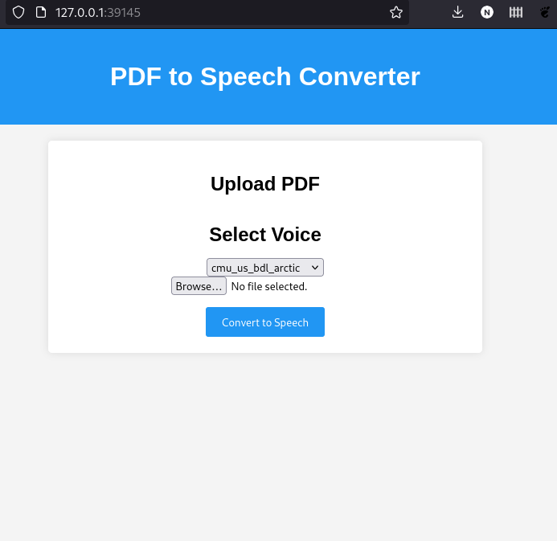
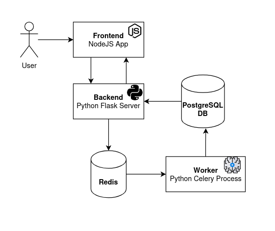
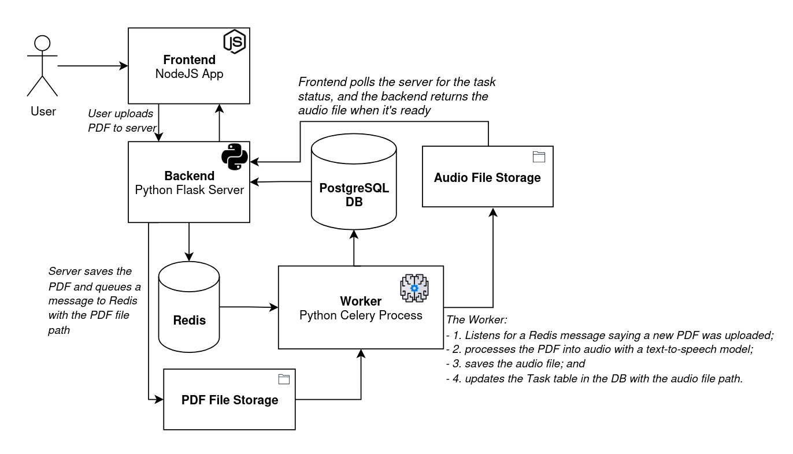
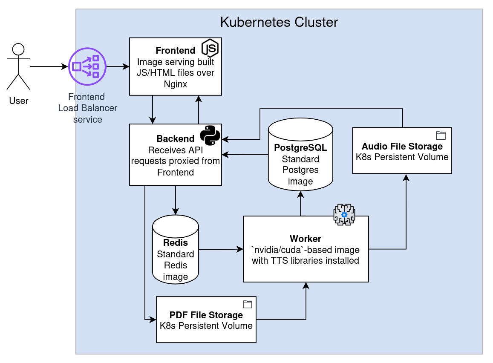
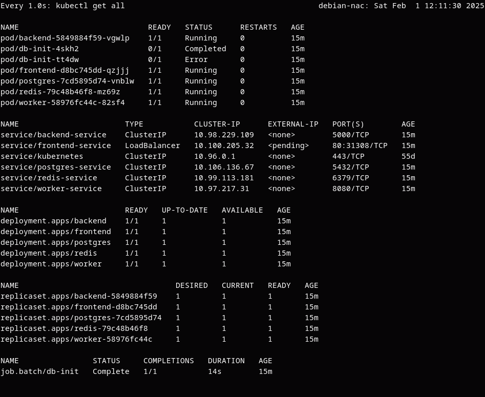
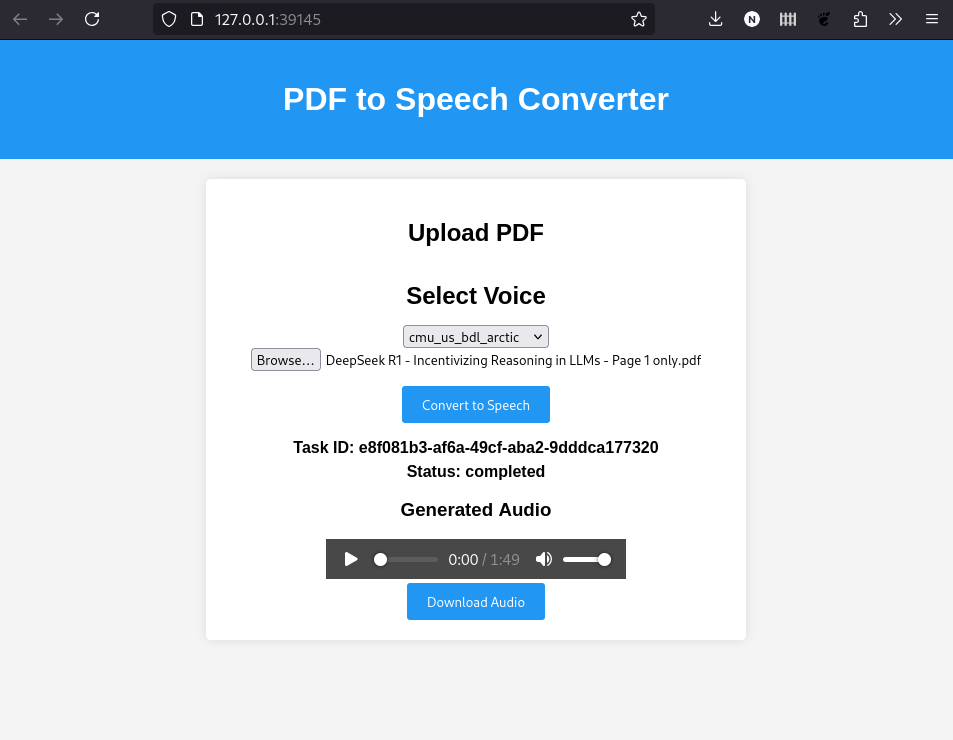
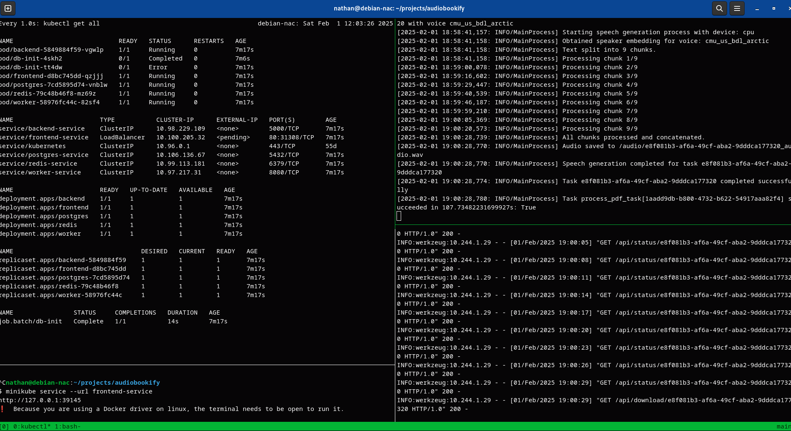

One of the more beautiful outcomes of AI development in recent years is the ability to quickly transform any written text into a spoken word format, almost instantly and for free. I love using the <a href="https://elevenlabs.io/" target="_blank">ElevenLabs</a> Android app to turn a long article or book into an audiobook and listen to it while driving or cleaning my house.

There have been moments when I wished I could customize the output, though. For example, when importing PDFs into the ElevenLabs app, sometimes the speaker will read page headers out loud on each new page. I decided to hack together an app that does something similar: provides a web page where a user can upload a PDF, and returns an audio file with that PDF being read.

While this app isn't too polished (yet, anyway!), it was fun to learn more about text-to-speech models, containerization, and Kubernetes. This write-up focuses on the system architecture and running it on a local Kubernetes cluster.

> <a href="https://github.com/naclonts/audiobookify" target="_blank">- Audiobookify GitHub repository 🐙😺 -</a>


*Welcome to Audiobookify! It may not be much, but it's mine. (Although, can I really call it mine if ChatGPT wrote most of the code? I'll say yes.)*


## Application Structure

The architecture of the application is shown in simplified form below:



There are five primary components of the system:

1. __Frontend__: This is a NodeJS process that serves a webpage to the user, allowing them to upload a PDF file to convert to audio, see the status of the text-to-audio process, and then play or download the resulting audio file.
2. __Backend/Server__: A Python Flask server that accepts the PDFs uploaded by the user and sends a message via Redis with the PDF details. The frontend polls this server for the text-to-audio job status, which the backend queries from the PostgreSQL database.
3. __Redis__: This is the message broker allowing the backend server to communicate with the worker.
4. __Worker__: This is where the magic happens. This is a Python Celery process that listens for messages sent from the backend via Redis. When received, it processes the PDF that the user uploaded, converts it into text, and renders that text as audio. That audio is then saved, and the worker updates the database to mark this task as complete.
5. __PostgreSQL Database__: When a PDF is uploaded, the backend creates a record in the `task` DB table. The worker then updates this with the `audio_path` when complete, allowing the server to return the audio file to the frontend.

The backend and worker share the same codebase in <a href="https://github.com/naclonts/audiobookify/tree/main/backend" target="_blank">the backend directory</a> of the repo, but have different Dockerfiles.

There are a couple of elements not covered in the above diagram. In addition to the Redis and PostgreSQL instances, we also need a place to store the uploaded PDF files and generated audio files. We'll store those in directories located on our system. Adding those elements (and some comments), a more complete architecture diagram looks like this:



When a user uploads a PDF, the backend saves the PDF to the "PDF File Storage", a directory on our machine, in addition to notifying the worker of the task via Redis. Similarly, when the worker finishes generating the audio, it saves the WAV file to the "Audio File Storage" in another directory. The SQL `task` table includes references to both the PDF and audio file paths.


## Kubernetes Configuration

Since this system has multiple components involved, running each component in a container can help reduce the overhead of setting everything up. Each of these components involves its own set of libraries that must be installed (for example, the worker requires some hefty machine learning libaries like HuggingFace, and the frontend needs a bunch of NPM packages). Instead of installing all these dependencies on our machine and dealing with any versioning conflicts, each component can be packaged as a container image with all of the libraries already installed.

I opted to organize these packages using Kubernetes, mostly for the sake of doing a hands-on project with K8s. Kubernetes will also allow us to deploy this application to the cloud and enable stuff like auto-scaling. This could be very useful if multiple users are generating audiobooks, as each worker process can take quite a while.

Translating our app architecture into Kubernetes objects gives us this:



Each of the rectangles in the diagram is a Kubernetes deployment, which manages one or more pods running the pre-built image for that component. The exception to this are the file storage components, which are Kubernetes <a href="https://kubernetes.io/docs/concepts/storage/persistent-volumes/" target="_blank">Persistent Volumes</a>, not deployments. The code defining each of these resources is in the repo's <a href="https://github.com/naclonts/audiobookify/tree/main/kubernetes/templates" target="_blank">kubernetes/templates</a> directory.

Not shown in this image are the services associated with each Deployment, which allow communication between pods within the cluster -- and, in the case of the Frontend Load Balancer Service, allows communication with the user outside the cluster.

Finally, I opted to use Helm to organize the Kubernetes, allowing us to install and run the cluster with a single command.

## Running the Things

### Running Locally with Minikube

To run the app locally, we need to:

1. Run `minikube start` (Docker must be running first)
2. From the `audiobookify` repo directory, run `helm install audiobookify ./kubernetes`

The Helm install pulls all the images and spins up the Kubernetes cluster, running locally on Minikube. This is all we need to do to install the application on a new system!

After doing these steps, the state of our local Kubernetes cluster looks like this:



Note the pods running the worker, backend, and frontend parts of the app, as well as the Redis and PostgreSQL images. The DB init job, which creates the `tasks` table, initially failed because the Postgres pod wasn't running, then completed successfully on the second attempt.

 The services include a load balancer for the serving the frontend. Since we're running with Minikube, we can make this accessible locally with:

```sh
minikube service --url frontend-service
```

Visiting the provided URL bring us to the web page, where we can pick a voice then upload a PDF to get the generated audio version:



The image below shows the application logs for our worker (top right pane) and backend (bottom right pane):



We can also connect to the DB and view the task that was processed:


### Running on AWS EKS

I haven't yet deployed this to the cloud. Doing so will require several changes, including:

1. Replacing the locally stored persistent volumes with volumes that use EBS or another cloud storage solution.
2. Evaluating the security stance of the app.
    - Getting spammed with thousands of file uploads could get expensive!
    - The app currently has no user authentication system, meaning anyone with a task ID could download an audio file generated by someone else.
3. Providing a public IP or domain name to access the app.
4. Following some best practices that I didn't use here, such as having a different Docker Hub repository for each component (i.e. frontend, backend, and worker).

Deploying this to production could be a good follow-up project!

## Conclusion

This project helped me learn more about using Kubernetes in a use case that's beyond a toy example, although not quite production ready.

It's also interesting to note that much of this code is AI generated, showing the utility of using LLMs for code generation to get a simple project running. Some assistance was also provided by GitHub Copilot chat in VSCode using Claude Sonnet and ChatGPT 4o, especially while configuring the Kubernetes templates. However, I was only able to get the LLMs' code and K8s templates to work after making manual adjustments. There were a lot of small issues that the LLMs didn't catch and required some human attention.


