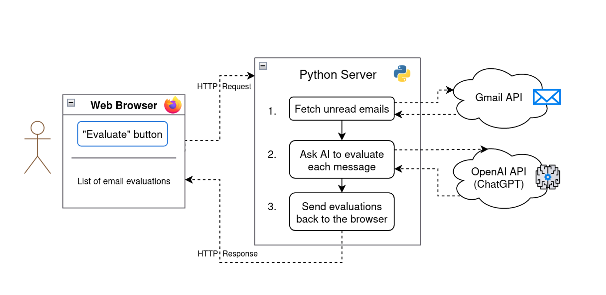
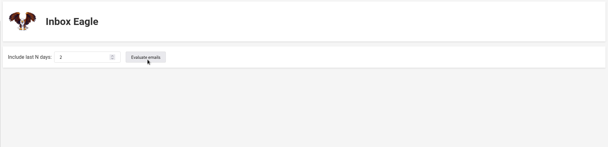

## Introduction

- [ ] add "from" email
- [ ]

## Motivation

## Demo

## Architecture

The flow of this application involves a few steps:

1. **Web frontend**: User clicks "Evaluate" to begin the process, triggering the...
2. **Python server**:
    1. **Fetch emails** via the Gmail API
    2. **Compose a prompt** for the LLM based on a personalized configuration
    3. **Query the LLM twice**:
        1. First, we ask for a written evaluation of the email's importance, including a score on a scale of 1 to 10
        2. Second, we ask the LLM to extract the numeric score from the written evaluation
3. **Web frontend**: Display the results of the evaluation

*Kicked off from the user's browser, our app pulls emails from Gmail and analyzes with ChatGPT*

The web frontend is a simple React app initialized with [create-react-app](https://create-react-app.dev/) and some copy-pasting from ChatGPT. The user can enter a number of days to query, then click an "Evaluate emails" button to begin the process.

The browser makes an HTTP request to the `/get-email-evaluations` endpoint on the Python server. From here, we fetch $ N $ days' worth of unread emails, then analyze them with an LLM (either ChatGPT or a locally-run model can be used!).

### AI Prompting

## Enhancements

There are lots of ways to improve this app! A few ideas:

1. Categorizing emails based on a predefined set of labels, such as "Customer Request", "Bug Report", and "Receipts"
    - This could involve labelling emails in Gmail, instead of displaying  them in a separate UI
2. Rather than just fetching unread emails, analyze all emails that *a)* haven't been responded to, and *b)* haven't already been evaluated
3. Write draft responses to some messages
4. Integrate with speech-to-text and text-to-speech models, creating in a voice assistant that can summarize your emails and deep-dive when you ask questions 🎙️🤖🔊

## Conclusion

