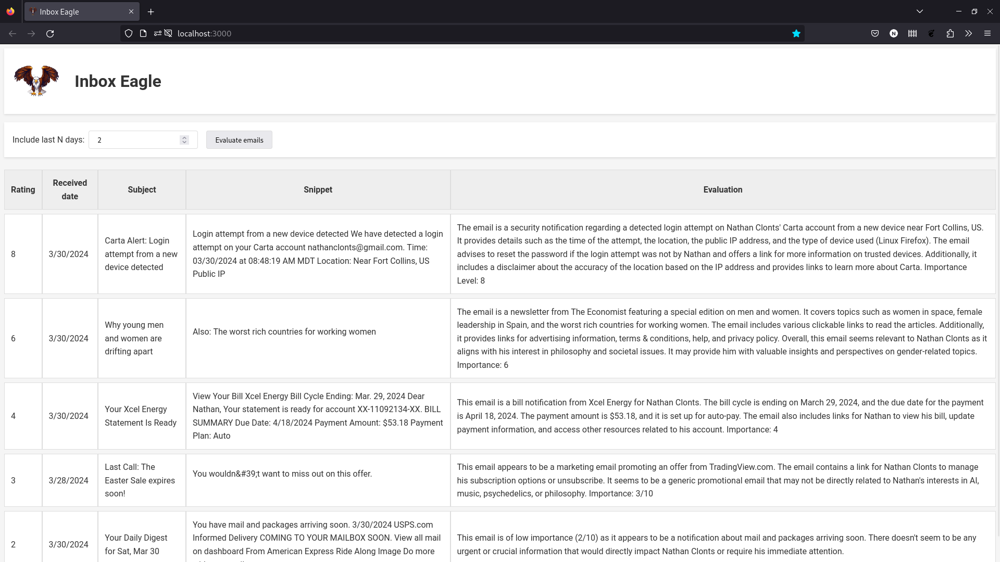

## Introduction

Many roles deal with a large number of incoming messages, whether via email or customer support chat software. It can be difficult to track and manage large volumes of contacts, which can result in mis-prioritization.

Traditional programming techniques don't offer an easy way to automate the analysis of large amounts of free text. However, LLMs make this process much easier. Using LLMs, we can sort messages by priority, apply tags, or analyze the sentiment.

This article discusses a simple application built to prioritize emails. The demo here is simply ranking emails in a Gmail inbox. In practice, this might be more useful in a shared inbox with many messages, rather than a personal email.

I wrote this application and article as an exercise for myself to integrate code with generative AI. During the course of development, I found some interesting surprises in the way that LLMs work.


## Demo

The web frontend is a simple React app initialized with [create-react-app](https://create-react-app.dev/) and some copy-pasting from ChatGPT. The user can enter a number of days to query, then click an "Evaluate emails" button to begin the process.


The browser makes an HTTP request to the `/get-email-evaluations` endpoint on the Python server. The server fetches $ N $ days' worth of unread emails, then analyze them with an LLM (either ChatGPT or a locally-run model can be used!).

The Python server asks the LLM to rate the relevance of messages, including some context about the user's interests and role.

Here are some example results:



In this run, the app ranks highly a security alert, and an Economist article that it thinks is relevant to my interests.

 On the other end of the importance scale are a stock USPS email, and a marketing promotion about a sale on some software.

We can also adjust our prompt to specify different traits to prioritize.


## Architecture

The flow of this application involves a few steps:

1. **Web frontend**: User clicks "Evaluate emails" to contact the Python server
2. **Python server**:
    1. **Fetch emails** via the Gmail API
    2. **Compose a prompt** for the LLM based on a personalized configuration
    3. **Query the LLM twice**:
        1. First, we ask for a written evaluation of the email's importance, including a score on a scale of 1 to 10
        2. Second, we ask the LLM to extract the numeric score from the written evaluation
3. **Web frontend**: Display the results of the evaluation


*Kicked off from the user's browser, our app pulls emails from Gmail and analyzes with ChatGPT*

## Implementation

The Python Flask endpoint looks something like this:

```python
@app.route('/get-email-evaluations', methods=['POST'])
def get_email_evaluations():
    num_days_to_include = request.get_json().get('numDaysToInclude')

    # Get the unread messages from Gmail
    messages = get_unread_messages(num_days_to_include)

    # Go through each message and get an evaluation from the LLM
    evaluations: list[MessageEvaluation]  = []
    prompt_config = load_prompt_config()
    for message in messages:
        evaluation = evaluate_message_importance(prompt_config, message)
        evaluations.append(evaluation)

    # Return the messages and ratings to the front-end
    return jsonify({
        'evaluations': evaluations,
    })
```

The Gmail API call is wrapped in the `get_unread_messages` function.

The more interesting stuff happens when we get to `evaluate_message_importance`, and coordinate code with AI to analyze our messages.

## AI Prompting


```python
def evaluate_message_importance(prompt_config, message: Message) -> MessageEvaluation:
    trimmed_content = message['body'][:2000] + '\n...\n' + message['body'][-2000:] + '\n...\nSnippet: ' + message['snippet']

    prompt = prompt_writer.get_message_evaluation_prompt(prompt_config, trimmed_content)

    response = get_llm_response(prompt_config, prompt)

    rating = extract_rating_from_evaluation(prompt_config, response)

    return MessageEvaluation(
        message=message,
        rating=rating,
        response=response,
        model=prompt_config['evaluator_model'],
    )
```

### User personalization with `prompt-config.json`

Before calling the function to evaluate messages, we first load a `prompt_config` object. This object is loaded from a JSON file with information about the user's name, interest, and optionally organization/company details. This personalization will be used to help prioritize our inbox appropriately.

Here's a sample file:

```json
{
    "full_name": "Nathan Clonts",
    "my_role": "software engineer who's interested in AI, music, and philosophy",
    "rating_critera": "Emails are important if they relate to my interests, my friends or family, my job, or important world news.",
    "evaluator_model": "gpt-3.5-turbo",
    "company_name": "",
    "company_description": "",
    "examples": []
}
```

### Evaluation

The evaluation function starts by trimming the email message body to a limited number of characters, to limit costs on long email threads:

```python
# limit the message to the first and last 2000 characters
trimmed_content = message['body'][:2000] + '\n...\n' + message['body'][-2000:] + '\n...\nSnippet: ' + message['snippet']
```

The next two lines write a prompt and then ask the AI for its evaluation of the importance of our email.

```python
prompt = prompt_writer.get_message_evaluation_prompt(prompt_config, trimmed_content)
response = get_llm_response(prompt_config, prompt)
```

The `get_message_evaluation_prompt` function forms a question to the AI based on the `prompt_config` that is set up for our user. Here's the function:

```python
def get_message_evaluation_prompt(prompt_config, message_content: str):
    return [
        {
            "role": "system",
            "content": f"""
                ### Objective:
                You are an executive assistant working a person named {prompt_config['full_name']} who is a {prompt_config['my_role']}.
                {get_company_clause(prompt_config)}

                You receive email messages, and evaluate how important they are for {prompt_config['full_name']} on a scale of 1 to 10.
                Summarize and evaluate the email, listing any specific facts that are important.
                At the end of your response, put the number of the importance of the email on a scale of 1 to 10.
                {get_rating_criteria_clause(prompt_config)}

                ### Example emails with importance level:

                {get_example_evaluations(prompt_config)}

            """
        },
        {
            "role": "user",
            "content": f"""
            Evaluate the following email and then rate its importance on a scale of 1 to 10:

            <email>
            {message_content}
            </email>
            """,
        }
    ]
```

This returns a list formatted for the OpenAI Chat Completions API. This API expects a "system" message which defines the mindset of the LLM, and a "user" message which contains the actual request. [[1]]

From this query, the LLM may return a response like the following:

> abc

Note that the numeric importance level is not always returned in the same place or format. LLMs are stochastic, meaning they  The last bit of our LLM evaluation extracts the numeric value from that string of text.

```python
rating = extract_rating_from_evaluation(prompt_config, response)
```

## Learnings


## Enhancements

There are lots of ways to improve this app! A few ideas:

1. Categorizing emails based on a predefined set of labels, such as "Customer Request", "Bug Report", and "Receipts"
    - This could involve labelling emails in Gmail, instead of displaying  them in a separate UI
2. Rather than just fetching unread emails, analyze all emails that *a)* haven't been responded to, and *b)* haven't already been evaluated
3. Write draft responses to some messages
4. Integrate with speech-to-text and text-to-speech models, creating in a voice assistant that can summarize your emails and deep-dive when you ask questions 🎙️🤖🔊


## Conclusion


[1]: https://platform.openai.com/docs/guides/text-generation/chat-completions-api "OpenAI API documentation: Chat Completions API"
